# IT Asset Inventory — Entity-Relationship Diagram

> Mermaid ERD for the multi-tenant IT asset inventory management system.
> Renders in any Markdown viewer that supports Mermaid (GitHub, VS Code, Obsidian, GitLab, etc.).
> This document is the **visual source of truth** for `prisma/schema.prisma` (to be generated from it in Phase 0).

---

## 1. Conventions

| Concern | Convention |
|---|---|
| **Multi-tenancy** | Every tenant-scoped table has a `tenant_id` FK → `tenants.id`. Composite indexes always start with `tenant_id`. |
| **Optimistic locking** | Every mutable entity has a `version Int @default(0)`. Updates include the current `version`; the `UPDATE` only succeeds if the row's version matches, then the version is bumped. Zero rows affected → `409 Conflict`. |
| **Timestamps** | `created_at` and `updated_at` on every table, stored in UTC. `created_by` (FK → `users.id`) where appropriate. |
| **Soft delete** | Status enums (`user_status`, `asset_status`, …) instead of `deleted_at` — keeps state explicit and queryable. |
| **Money** | `Decimal(12,2)` for all cost / price fields; currency snapshot at purchase. |
| **IDs** | `cuid()` for primary keys (collision-resistant, URL-safe, sortable). |
| **JSONB** | Used for `attributes`, `settings`, `payload`, `before`, `after`, `data`, `events`, `to_emails`. Each gets a GIN index where it supports search. |
| **Cascade** | `ON DELETE RESTRICT` by default; `ON DELETE CASCADE` only for owned children (e.g. `asset_attributes`). |
| **Audit** | Every mutating request writes a row to `audit_log` with `before` + `after` JSONB snapshots. |

## 2. Common fields (added to every tenant-scoped table)

| Field | Type | Notes |
|---|---|---|
| `tenant_id` | FK → `tenants.id` | Indexed; first column in every composite index |
| `version` | `Int` | Optimistic-lock counter, default `0` |
| `created_at` | `DateTime` | UTC, set on insert |
| `updated_at` | `DateTime` | UTC, set on every update |
| `created_by` | FK → `users.id` | NULL for system-created rows |

These are **omitted from the per-table attribute blocks below** to keep the diagram readable, but every tenant-scoped table will have them in the Prisma schema.

## 3. ERD

```mermaid
erDiagram
    %% ============================================================
    %% TENANCY
    %% ============================================================
    TENANTS {
        string id PK
        string slug UK "URL-safe, e.g. 'acme'"
        string name
        string status "active|suspended|trial"
        string plan "free|pro|enterprise"
        string default_currency "ISO 4217, e.g. 'USD'"
        int default_warranty_months
        jsonb settings
        datetime created_at
        datetime updated_at
    }

    DEPARTMENTS {
        string id PK
        string tenant_id FK
        string name
        string code
        string head_id FK "users.id, nullable"
        datetime created_at
        datetime updated_at
    }

    LOCATIONS {
        string id PK
        string tenant_id FK
        string name
        string type "office|building|room|data_center|remote"
        string parent_id FK "self, nullable"
        text address
        datetime created_at
        datetime updated_at
    }

    %% ============================================================
    %% IDENTITY & ACCESS
    %% ============================================================
    ROLES {
        string id PK
        string tenant_id FK "nullable for built-in roles"
        string name "super_admin|it_manager|it_support|dept_head|employee"
        text description
        boolean is_builtin
    }

    PERMISSIONS {
        string id PK
        string code UK "e.g. assets:read:all"
        text description
    }

    ROLE_PERMISSIONS {
        string role_id FK
        string permission_id FK
    }

    USERS {
        string id PK
        string tenant_id FK
        string email
        string password_hash
        string full_name
        string phone
        string avatar_url
        string role_id FK
        string department_id FK "nullable"
        string status "active|disabled|pending"
        datetime last_login_at
        datetime created_at
        datetime updated_at
    }

    PASSWORD_RESET_TOKENS {
        string id PK
        string user_id FK
        string token UK
        datetime expires_at
        datetime used_at
    }

    %% ============================================================
    %% CATALOG
    %% ============================================================
    CATEGORIES {
        string id PK
        string tenant_id FK
        string name
        string type "hardware|software|peripheral|accessory"
        string parent_id FK "self, nullable"
        text description
        datetime created_at
        datetime updated_at
    }

    VENDORS {
        string id PK
        string tenant_id FK
        string name
        string contact_person
        string email
        string phone
        text address
        string website
        string status "active|inactive"
        datetime created_at
        datetime updated_at
    }

    %% ============================================================
    %% ASSETS (the core)
    %% ============================================================
    ASSETS {
        string id PK
        string tenant_id FK
        string asset_tag "unique within tenant, e.g. ACME-LAP-00001"
        string name
        string category_id FK
        string manufacturer
        string model
        string serial_number
        string mac_address
        string status "in_stock|assigned|in_repair|retired|lost"
        string location_id FK
        string vendor_id FK "nullable"
        string currency "snapshot at purchase"
        decimal purchase_cost
        date purchase_date
        date warranty_expiry
        int depreciation_months
        jsonb attributes "JSONB: flexible per-asset specs"
        text notes
        string created_by FK
        datetime created_at
        datetime updated_at
    }

    ASSET_ATTRIBUTES {
        string id PK
        string asset_id FK
        string key
        jsonb value
    }

    ASSET_PHOTOS {
        string id PK
        string asset_id FK
        string file_path
        string caption
        string uploaded_by FK
        datetime uploaded_at
    }

    ASSIGNMENTS {
        string id PK
        string tenant_id FK
        string asset_id FK
        string user_id FK "the assignee"
        string assigned_by FK
        datetime assigned_at
        datetime expected_return_at
        datetime returned_at "nullable while open"
        string signature_path "scanned signature image, nullable"
        text notes
        datetime created_at
        datetime updated_at
    }

    %% ============================================================
    %% LICENSES
    %% ============================================================
    SOFTWARE_LICENSES {
        string id PK
        string tenant_id FK
        string name
        string vendor_id FK "nullable"
        string license_key
        int seats_total
        string currency
        decimal cost
        date purchase_date
        date expiry_date
        text notes
        datetime created_at
        datetime updated_at
    }

    LICENSE_SEATS {
        string id PK
        string tenant_id FK
        string license_id FK
        string asset_id FK "nullable: device license"
        string user_id FK "nullable: named-user license"
        datetime assigned_at
        datetime released_at "nullable while active"
    }

    %% ============================================================
    %% MAINTENANCE
    %% ============================================================
    MAINTENANCE_RECORDS {
        string id PK
        string tenant_id FK
        string asset_id FK
        string type "repair|upgrade|inspection|warranty_claim"
        text description
        string currency
        decimal cost
        string vendor_id FK "nullable"
        string performed_by FK "nullable"
        date performed_at
        string status "open|in_progress|closed"
        datetime created_at
        datetime updated_at
    }

    %% ============================================================
    %% APPROVALS
    %% ============================================================
    APPROVAL_REQUESTS {
        string id PK
        string tenant_id FK
        string type "asset_assign|asset_retire|asset_delete|user_disable"
        string status "pending|approved|rejected|cancelled"
        string entity_type
        string entity_id
        jsonb payload "the proposed change"
        string requested_by FK
        datetime requested_at
        string approver_id FK "nullable"
        datetime approved_at "nullable"
        text rejection_reason "nullable"
        datetime created_at
        datetime updated_at
    }

    %% ============================================================
    %% NOTIFICATIONS
    %% ============================================================
    NOTIFICATIONS {
        string id PK
        string tenant_id FK
        string user_id FK
        string type "approval_pending|approval_resolved|asset_*|..."
        string title
        text body
        string link
        datetime read_at "nullable while unread"
        datetime created_at
    }

    EMAIL_JOBS {
        string id PK
        string tenant_id FK
        jsonb to_emails "text[]"
        string subject
        string template
        jsonb data
        string status "queued|sending|sent|failed"
        int attempts
        text last_error
        datetime sent_at "nullable"
        datetime created_at
    }

    WEBHOOK_SUBSCRIPTIONS {
        string id PK
        string tenant_id FK
        string channel "slack|teams"
        text url "encrypted at rest with AES-256-GCM"
        jsonb events "text[]"
        string created_by FK
        datetime last_delivered_at "nullable"
        text last_error "nullable"
        datetime created_at
        datetime updated_at
    }

    %% ============================================================
    %% AUDIT
    %% ============================================================
    AUDIT_LOG {
        string id PK
        string tenant_id FK
        string user_id FK "nullable for system actions"
        string action "create|update|delete|login|logout|approval.request|approval.approve|approval.reject|..."
        string entity_type
        string entity_id
        jsonb before "snapshot before change, nullable"
        jsonb after "snapshot after change, nullable"
        string ip
        text user_agent
        datetime created_at
    }

    %% ============================================================
    %% RELATIONSHIPS
    %% ============================================================
    TENANTS ||--o{ DEPARTMENTS           : "has"
    TENANTS ||--o{ LOCATIONS             : "has"
    TENANTS ||--o{ USERS                 : "has"
    TENANTS ||--o{ CATEGORIES            : "has"
    TENANTS ||--o{ VENDORS               : "has"
    TENANTS ||--o{ ASSETS                : "owns"
    TENANTS ||--o{ ASSIGNMENTS           : "has"
    TENANTS ||--o{ SOFTWARE_LICENSES     : "has"
    TENANTS ||--o{ LICENSE_SEATS         : "has"
    TENANTS ||--o{ MAINTENANCE_RECORDS   : "has"
    TENANTS ||--o{ APPROVAL_REQUESTS     : "has"
    TENANTS ||--o{ NOTIFICATIONS         : "has"
    TENANTS ||--o{ EMAIL_JOBS            : "has"
    TENANTS ||--o{ WEBHOOK_SUBSCRIPTIONS : "has"
    TENANTS ||--o{ AUDIT_LOG             : "has"
    TENANTS ||--o{ ROLES                 : "defines"

    DEPARTMENTS ||--o{ USERS             : "members"
    USERS       ||--o{ DEPARTMENTS       : "heads"

    LOCATIONS   ||--o{ LOCATIONS         : "parent_of"
    LOCATIONS   ||--o{ ASSETS            : "stores"

    ROLES       ||--o{ USERS             : "granted_to"
    ROLES       ||--o{ ROLE_PERMISSIONS  : "has"
    PERMISSIONS ||--o{ ROLE_PERMISSIONS  : "granted_in"

    CATEGORIES  ||--o{ CATEGORIES        : "parent_of"
    CATEGORIES  ||--o{ ASSETS            : "classifies"

    VENDORS     ||--o{ ASSETS            : "supplies"
    VENDORS     ||--o{ SOFTWARE_LICENSES : "supplies"
    VENDORS     ||--o{ MAINTENANCE_RECORDS : "performs"

    ASSETS      ||--o{ ASSET_ATTRIBUTES  : "has"
    ASSETS      ||--o{ ASSET_PHOTOS      : "has"
    ASSETS      ||--o{ ASSIGNMENTS       : "history"
    ASSETS      ||--o{ MAINTENANCE_RECORDS : "history"
    ASSETS      ||--o{ LICENSE_SEATS     : "hosts"

    USERS       ||--o{ ASSIGNMENTS       : "assigned_to"
    USERS       ||--o{ ASSIGNMENTS       : "assigned_by"
    USERS       ||--o{ LICENSE_SEATS     : "consumes"
    USERS       ||--o{ MAINTENANCE_RECORDS : "performed"
    USERS       ||--o{ APPROVAL_REQUESTS : "requested"
    USERS       ||--o{ APPROVAL_REQUESTS : "approved"
    USERS       ||--o{ NOTIFICATIONS     : "receives"
    USERS       ||--o{ PASSWORD_RESET_TOKENS : "owns"
    USERS       ||--o{ ASSETS            : "created"
    USERS       ||--o{ WEBHOOK_SUBSCRIPTIONS : "created"
    USERS       ||--o{ AUDIT_LOG         : "actor"

    SOFTWARE_LICENSES ||--o{ LICENSE_SEATS : "allocates"
```



## 4. Relationship notes

| Relationship | Cardinality | Notes |
|---|---|---|
| `tenants → users` | 1:N | Every user belongs to exactly one tenant. `users.email` is unique within a tenant: `UNIQUE(tenant_id, email)`. |
| `tenants → assets` | 1:N | Assets are owned by one tenant. `assets.asset_tag` is unique within a tenant: `UNIQUE(tenant_id, asset_tag)`. |
| `roles → users` | 1:N | Each user has exactly one role. Built-in roles (`is_builtin = true`) are global, with `tenant_id = NULL`. Custom roles are per-tenant. |
| `roles ↔ permissions` | M:N | Via `role_permissions`. The 5 built-in roles are seeded; tenants can clone a role and customize. |
| `departments → users` | 1:N | A user belongs to one department; a department has many users. `departments.head_id` is the user who heads it. |
| `locations → locations` | self 1:N | Hierarchical: office → building → room. `parent_id` is nullable for root locations. |
| `categories → categories` | self 1:N | Hierarchical: hardware → laptop → ThinkPad. `type` enum lives on the category. |
| `assets → categories` | N:1 | Every asset has one category. |
| `assets → locations` | N:1 | Every asset has one current location. |
| `assets → vendors` | N:0..1 | Optional — required for purchased assets, NULL for internally-built/test. |
| `assets → asset_attributes` | 1:N | Key-value for flexible specs. See open question 1 below. |
| `assets → asset_photos` | 1:N | Multiple photos per asset (1:N). |
| `assets → assignments` | 1:N | Full history. `returned_at IS NULL` ⇒ currently assigned. |
| `assignments → users` (assigned_by) | N:1 | The user (admin/manager) who performed the assignment. |
| `licenses → vendors` | N:0..1 | License vendor. |
| `license_seats → licenses` | N:1 | Each seat belongs to one license. |
| `license_seats → users` / `→ assets` | N:0..1 each | A seat is either assigned to a user (named-user) or to an asset (device). Exactly one of the two should be non-NULL — enforced in app logic + a CHECK constraint. |
| `approval_requests` | per-tenant | All approval-required actions create a row here. `payload` JSONB holds the proposed change. |
| `notifications` | per-tenant, per-user | In-app bell feed. |
| `email_jobs` | per-tenant | Queue for outbound email (worker in v1 = in-process; later = BullMQ). |
| `webhook_subscriptions` | per-tenant | Outbound Slack/Teams webhooks. `url` is encrypted at rest with AES-256-GCM. |
| `audit_log` | per-tenant | Every mutating request writes here. `before` + `after` are JSONB snapshots. |
| `password_reset_tokens` | per-user | One-time tokens. `used_at IS NULL AND expires_at > now()` ⇒ valid. |

## 5. Indexes (beyond PKs and FKs)

| Table | Index | Reason |
|---|---|---|
| `users` | `UNIQUE(tenant_id, email)` | Login lookup; email uniqueness within a tenant |
| `users` | `(tenant_id, status)` | "Active users" list |
| `users` | `(tenant_id, role_id)` | "Users with role X" |
| `assets` | `UNIQUE(tenant_id, asset_tag)` | Asset tag uniqueness within a tenant |
| `assets` | `(tenant_id, status)` | Status filter (in-stock / assigned / in-repair / …) |
| `assets` | `(tenant_id, category_id)` | Category filter |
| `assets` | `(tenant_id, location_id)` | Location filter |
| `assets` | `(tenant_id, vendor_id)` | Vendor filter |
| `assets` | `GIN(attributes jsonb_path_ops)` | Fast search on flexible specs (e.g. `attributes @> '{"ram_gb": 32}'`) |
| `assignments` | `(asset_id) WHERE returned_at IS NULL` | Partial index: currently-assigned per asset |
| `assignments` | `(user_id) WHERE returned_at IS NULL` | Partial index: a user's currently-assigned assets |
| `licenses` | `(tenant_id, expiry_date)` | "Expiring soon" report |
| `license_seats` | `(license_id) WHERE released_at IS NULL` | Partial index: active seats |
| `maintenance_records` | `(asset_id, performed_at DESC)` | Asset maintenance history |
| `notifications` | `(user_id, read_at, created_at DESC)` | Bell feed |
| `email_jobs` | `(status, created_at)` | Worker pick-up |
| `audit_log` | `(tenant_id, entity_type, entity_id, created_at DESC)` | Per-entity history |
| `audit_log` | `(tenant_id, user_id, created_at DESC)` | Per-user activity |
| `approval_requests` | `(tenant_id, status, requested_at DESC)` | Approval queue |
| `password_reset_tokens` | `UNIQUE(token)`, `(expires_at)` | Lookup + cleanup |

## 6. Denormalized view: `asset_current_assignee`

To answer "which assets does user X currently have?" without scanning `assignments`:

```sql
CREATE VIEW asset_current_assignee AS
SELECT
    a.id          AS asset_id,
    a.tenant_id,
    asg.user_id   AS current_user_id
FROM assets a
JOIN LATERAL (
    SELECT user_id
    FROM assignments
    WHERE asset_id = a.id AND returned_at IS NULL
    ORDER BY assigned_at DESC
    LIMIT 1
) asg ON true;
```

Powers the `users → current_assets` and `assets → current_assignee` lookups without a join in the hot path.

## 7. Open questions (resolve before generating migrations)

1. **`asset_attributes` table vs `assets.attributes` JSONB column** — the ERD shows both. **Recommend:** keep only `assets.attributes` JSONB with a GIN index; drop the `asset_attributes` table. The JSONB path is more flexible and avoids an N+1 on read.
2. **Snapshot fields on `assignments`** — copy `asset_tag`, `user_email`, `user_full_name` at assignment time so historical reports survive renames? (Probably yes — call it "historical snapshot".)
3. **Currency** — `assets.currency`, `software_licenses.currency`, `maintenance_records.currency` confirmed. Also store `reporting_currency` on `tenants.settings` for org-wide rollups.
4. **Soft-delete pattern** — keep `status` enums (current plan) or add a `deleted_at` timestamp? (Recommend: keep status enums — more explicit, easier to filter.)
5. **Multi-tenancy on `permissions`** — are permissions global (current: yes, `permissions` has no `tenant_id`) or per-tenant (each tenant defines their own permission codes)? (Recommend: global — keeps the role/permission matrix in code, simpler to audit.)
6. **Audit log retention** — how long to keep rows? Forever / 1 year / 7 years? Affects partitioning strategy.

## 8. Enums (Postgres `CREATE TYPE`)

```
asset_status:        in_stock | assigned | in_repair | retired | lost
category_type:       hardware | software | peripheral | accessory
location_type:       office | building | room | data_center | remote
maintenance_type:    repair | upgrade | inspection | warranty_claim
maintenance_status:  open | in_progress | closed
user_status:         active | disabled | pending
tenant_status:       active | suspended | trial
tenant_plan:         free | pro | enterprise
approval_type:       asset_assign | asset_retire | asset_delete | user_disable
approval_status:     pending | approved | rejected | cancelled
notification_type:   approval_pending | approval_approved | approval_rejected
                     asset_assigned | asset_returned | asset_retired
                     warranty_expiring | license_expiring | password_reset
email_job_status:    queued | sending | sent | failed
webhook_channel:     slack | teams
```

## 9. Out of scope for v1 (tracked, not modeled)

- File attachments on maintenance / approvals (could be a `attachments` polymorphic table in v2).
- Custom fields per category (handled via `assets.attributes` JSONB; no separate table needed).
- Multi-currency conversion on reports (just snapshot the currency, leave conversion to a future analytics layer).
- SSO / LDAP / SAML (no tables needed; just auth providers at the application layer).
- Mobile / offline sync (future).
